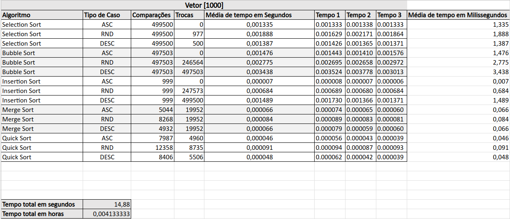
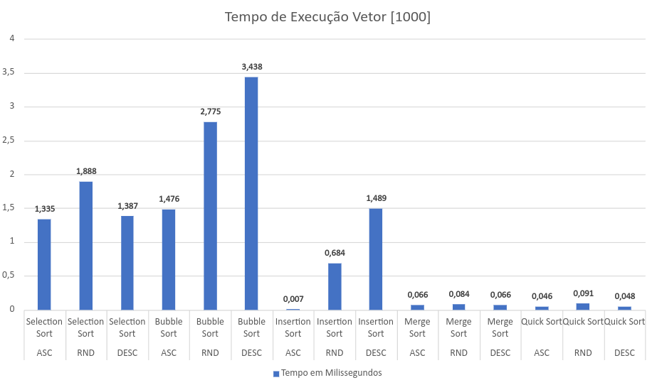
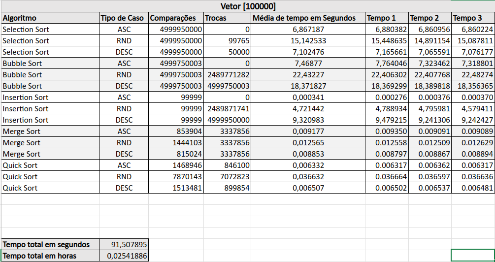
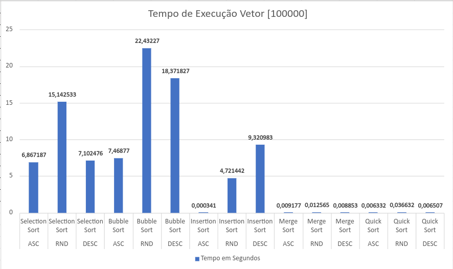
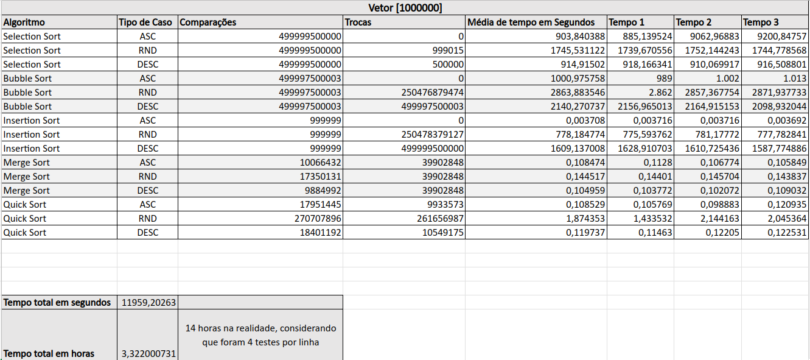
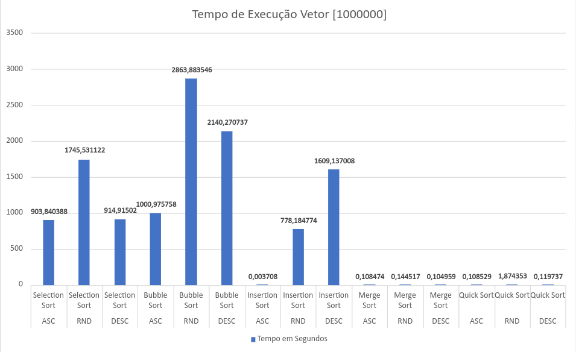

# lepresort-analytics 🍀

Projeto da disciplina ESDD (Estrutura de Dados) focado na avaliação de performance de algoritmos de ordenação. Nosso objetivo? Ajudar nossos amigos leprechauns 🍀 a ordenar suas moedas e proteger seus potes de ouro 🏆 com eficiência!

# Resultados dos Testes de Algoritmos de Ordenação
Aqui está apresentado os resultados dos testes de desempenho para os algoritmos de ordenação **bubblesort**, **selectionsort**, **insertsort**, **mergesort** e **quicksort** em diferentes cenários.

Você pode reproduzir os testes exatos em sua máquina, pois os data_sets utilizados podem ser encontrados em: **./datasets_utilizados**. Para carregar esses data_sets basta executar o programa e seguir as instruções.

## Métodos de Classificação
Os métodos de classificação testados incluem:
- Bubblesort
- Selectionsort
- Insertsort
- Mergesort
- Quicksort

## Casos de Teste
Cada algoritmo foi testado nos seguintes cenários:

1. **Melhor Caso**
   - Melhor Caso 1: Vetor ordenado com 1.000 elementos
   - Melhor Caso 2: Vetor ordenado com 100.000 elementos
   - Melhor Caso 3: Vetor ordenado com 1.000.000 elementos

2. **Caso Médio**
   - Caso Médio 1: Vetor aleatório com 1.000 elementos
   - Caso Médio 2: Vetor aleatório com 100.000 elementos
   - Caso Médio 3: Vetor aleatório com 1.000.000 elementos

3. **Pior Caso**
   - Pior Caso 1: Vetor invertido com 1.000 elementos
   - Pior Caso 2: Vetor invertido com 100.000 elementos
   - Pior Caso 3: Vetor invertido com 1.000.000 elementos

## Métricas Avaliadas
Para cada método de ordenação e caso de teste, foram registradas as seguintes métricas:
- **Número de Comparações**
- **Número de Trocas**
- **Tempo Consumido**

## Especificações da Máquina e Detalhes sobre os Testes

Os testes foram realizados em um **Ryzen 5 3600** com **32GB de RAM** em um sistema **Ubuntu**.
Cada algorítimo foi testado **4** vezes por cenário de teste.

As primeiras 3 vezes foram rodadas sem contagem de Comparações ou Trocas, apenas para avaliar o tempo.
A média desses tempos é o que se tornou a métrica de tempo oficial.
A quarta vez efetua a contagem de Trocas e Comparações.

## Tabelas de Resultados 📊 

# Arquivo de 1000 Elementos

# Arquivo de 100000 Elementos

# Arquivo de 1000000 Elementos

---

